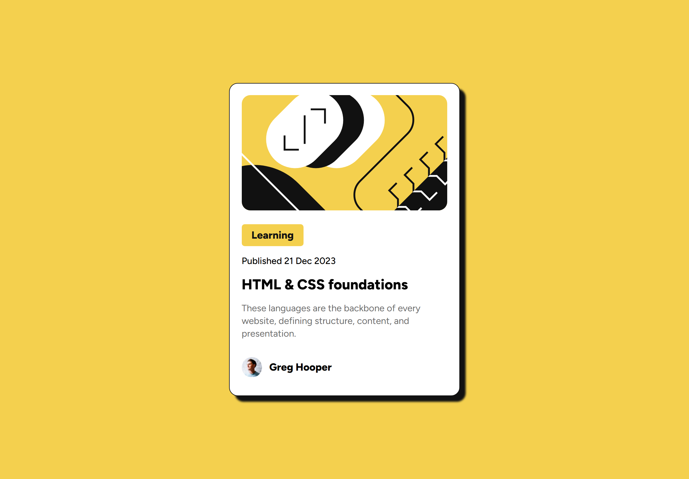

# Frontend Mentor - Blog preview card solution

This is a solution to the [Blog preview card challenge on Frontend Mentor](https://www.frontendmentor.io/challenges/blog-preview-card-ckPaj01IcS). Frontend Mentor challenges help you improve your coding skills by building realistic projects.

## Table of contents

- [Overview](#overview)
  - [The challenge](#the-challenge)
  - [Screenshot](#screenshot)
  - [Links](#links)
- [My process](#my-process)
  - [Built with](#built-with)
  - [What I learned](#what-i-learned)
  - [Continued development](#continued-development)
- [Author](#author)
- [Acknowledgments](#acknowledgments)

## Overview

### The challenge

Users should be able to:

- See hover and focus states for all interactive elements on the page

### Screenshot



### Links

- Solution URL: [Source code](https://github.com/PriestEmma/frontend-portfolio/tree/main/blog-preview-card-main)
- Live Site URL: [Live demo](https://frontport2.netlify.app/)

## My process

### Built with

- Semantic HTML5 markup
- CSS custom properties
- Flexbox
- CSS Grid
- Mobile-first workflow

### What I learned

I learned about the `aspect-ratio` property and how to use it together with a fixed height.

```css
aspect-ratio: 16 / 9;
height: 200px;
```

### Continued development

I'm still having some issues with image resizing and I'm still working on that.

## Author

- Website - [Priest Emma](https://frontport2.netlify.app/)
- Frontend Mentor - [@Priest Emma](https://www.frontendmentor.io/profile/PriestEmma)

## Acknowledgments

Thank you to Frontend Mentor for the opportunity to learn from their challenges.
