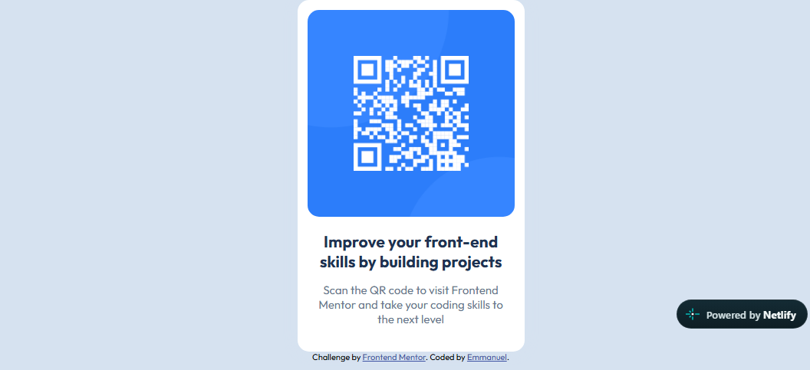

# Frontend Mentor - QR code component solution

This is a solution to the [QR code component challenge on Frontend Mentor](https://www.frontendmentor.io/challenges/qr-code-component-iux_sIO_H). Frontend Mentor challenges help you improve your coding skills by building realistic projects.

## Table of contents

- [Overview](#overview)
  - [Screenshot](#screenshot)
  - [Links](#links)
- [My process](#my-process)
  - [Built with](#built-with)
  - [Continued development](#continued-development)
- [Author](#author)
- [Acknowledgments](#acknowledgments)

## Overview

### Screenshot

### Links

- Solution URL: [Add solution URL here](https://github.com/PriestEmma/frontend-portfolio/tree/main/qr-code-component-main)

- Live Site URL: [ Click to Open to Site](https://frontport1.netlify.app/)

## My process

### Built with

- Semantic HTML5 markup
- CSS custom properties
- Flexbox
- CSS Grid
- Responsive design

### Continued development

Css Grid mostly and flexbox.

## Author

- Website - [Priest Emma](https://frontport1.netlify.app/)
- Frontend Mentor - [@Priest Emma](https://www.frontendmentor.io/profile/PriestEmma)

## Acknowledgments

Thank you frontend Mentor for this opportunity to have real hands on project for absolute beginners.
