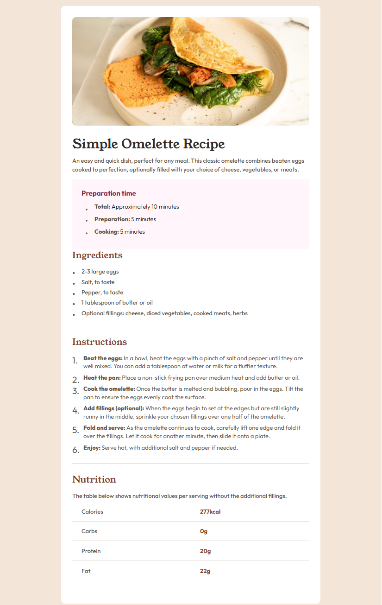

# Frontend Mentor - Recipe page solution

This is a solution to the [Recipe page challenge on Frontend Mentor](https://www.frontendmentor.io/challenges/recipe-page-KiTsR8QQKm). Frontend Mentor challenges help you improve your coding skills by building realistic projects.

## Table of contents

- [Overview](#overview)
  - [The challenge](#the-challenge)
  - [Screenshot](#screenshot)
  - [Links](#links)
- [My process](#my-process)
  - [Built with](#built-with)
  - [What I learned](#what-i-learned)
- [Author](#author)
- [Acknowledgments](#acknowledgments)

## Overview

### Screenshot



### Links

Solution URL: [Source code](https://github.com/PriestEmma/frontend-portfolio/tree/main/recipe-page-main)
Live Site URL: [Live demo](https://frontport4.netlify.app/)

## My process

### Built with

- Semantic HTML5 markup
- CSS custom properties
- Flexbox
- CSS Grid
- Mobile-first workflow

### What I learned

I learned about CSS counters. counter-reset sets a counter to 0, counter-increment increases it by 1 for each element it's applied to, and counter() displays the current count, which I used inside ::before to number my list items.

```css
ol {
  counter-reset: item;
}

li {
  counter-increment: item;
}

li::before {
  content: counter(item) '. ';
}
```

## Author

- Website - [Priest Emma](https://frontport4.netlify.app/)
- Frontend Mentor - [@Priest Emma](https://www.frontendmentor.io/profile/PriestEmma)

## Acknowledgments

Thank you to Frontend Mentor for the opportunity to learn from their challenges.
