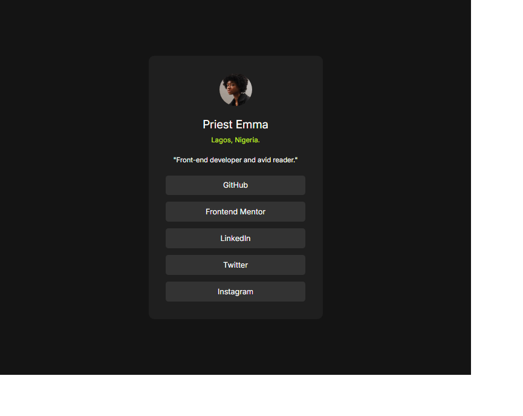

# Frontend Mentor - Social links profile solution

This is a solution to the Social links profile challenge on Frontend Mentor. Frontend Mentor challenges help you improve your coding skills by building realistic projects.

## Table of contents

- [Overview](#overview)
  - [The challenge](#the-challenge)
  - [Screenshot](#screenshot)
  - [Links](#links)
- [My process](#my-process)
  - [Built with](#built-with)
  - [What I learned](#what-i-learned)
- [Author](#author)
- [Acknowledgments](#acknowledgments)

## Overview

### The challenge

Users should be able to:

- See hover and focus states for all interactive elements on the page

### Screenshot



### Links

- Solution URL: [Source code](https://github.com/PriestEmma/frontend-portfolio/tree/main/social-links-profile-main)
- Live Site URL: [Live demo](https://frontport3.netlify.app/)

## My process

### Built with

- Semantic HTML5 markup
- CSS custom properties
- Flexbox
- CSS Grid
- Mobile-first workflow

### What I learned

I learned about `outline-offset`, which adds space between an element and its outline.

```css
a:focus-visible {
  outline: 2px solid blue;
  outline-offset: 3px;
}
```

I also learned how `clamp()` scales text size from mobile to desktop.

```css
font-size: clamp(0.89rem, calc(1rem - 0.3vw), 0.9rem);
```

## Author

- Website - [Priest Emma](https://frontport3.netlify.app/)
- Frontend Mentor - [@Priest Emma](https://www.frontendmentor.io/profile/PriestEmma)

## Acknowledgments

Thank you to Frontend Mentor for the opportunity to learn from their challenges.
